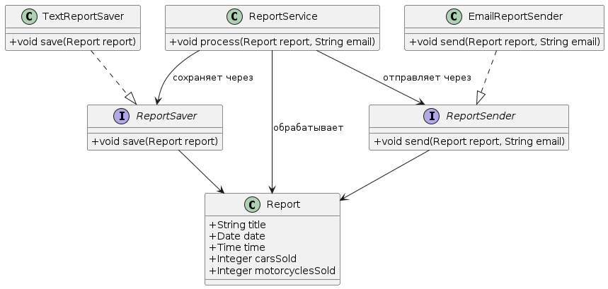

# Практика 2. Принципы SOLID

## Цель

Спроектировать сервис работы с отчётами так, чтобы его можно было расширять новыми способами сохранения и отправки без изменения основного сценария.

## Принципы SOLID

- **Single Responsibility Principle** — у каждого компонента одна ответственность и одна причина для изменения.
- **Open/Closed Principle** — новое поведение добавляется расширением, а не редактированием работающего сценария.
- **Liskov Substitution Principle** — любую реализацию контракта можно заменить другой без изменения клиентского кода.
- **Interface Segregation Principle** — потребители зависят только от операций, которые им действительно нужны.
- **Dependency Inversion Principle** — основной сценарий зависит от контрактов, а не от конкретного файла, email-клиента или мессенджера.

## Предметная задача

Нужно создать приложение, которое:

1. Формирует отчёт о продажах автомобилей и мотоциклов.
2. Сохраняет отчёт в файл.
3. Отправляет отчёт указанному получателю по email.

В учебной реализации вместо реальной отправки email допустимо вывести в консоль адрес получателя и факт отправки.

## Часть 1. Вариант без SOLID

Сначала реализуйте один сервис, который самостоятельно:

- формирует текст отчёта;
- сохраняет его в файл;
- отправляет или имитирует отправку email.

Этот вариант намеренно объединяет несколько ответственностей. Проанализируйте, какие изменения понадобятся при добавлении JSON/PDF-экспорта или отправки в Telegram.

## Часть 2. Вариант с SOLID

Разделите систему на следующие роли.

| Роль | Ответственность |
|---|---|
| `Report` | Неизменяемые данные отчёта: заголовок, дата, время и показатели продаж. |
| `ReportSaver` | Контракт сохранения отчёта. |
| `TextReportSaver` | Реализация сохранения текстового представления отчёта в файл. Имя файла формируется из даты и времени отчёта. |
| `ReportSender` | Контракт доставки отчёта получателю. |
| `EmailReportSender` | Реализация или имитация отправки отчёта по указанному email. |
| `ReportService` | Основной сценарий: сохранить отчёт, затем отправить его. |

### UML-диаграмма

`ReportService` получает реализации `ReportSaver` и `ReportSender` извне и не должен создавать их самостоятельно.

### Валидация и ошибки

Проверьте входные данные в точке их использования:

- отчёт и email не должны быть пустыми или отсутствовать;
- числовые показатели отчёта не должны быть отрицательными;
- ошибка записи файла должна сохранять исходную причину.

Для прикладных ошибок используйте собственный тип исключения или ошибки. Он должен содержать код ошибки, понятное сообщение и, при наличии, исходную причину.

## Демонстрация

Создайте один отчёт, настройте текстовый сохранитель и email-отправитель, затем передайте их сервису отчётов. После запуска ожидаются:

- текстовый файл в каталоге для отчётов с датой и временем в имени;
- сообщение об отправке с заголовком отчёта и email получателя.

## Тестирование

Покройте тестами как минимум:

- порядок действий основного сервиса: сначала сохранение, затем отправка;
- сохранение содержимого отчёта в сформированный файл;
- отправку с корректным получателем;
- обработку отсутствующего отчёта или email;
- код и причину прикладной ошибки при сбое записи файла.

## Самопроверка

- [ ] Модель отчёта не зависит от файловой системы и email.
- [ ] Сохранение и отправка представлены разными небольшими контрактами.
- [ ] Основной сервис зависит только от этих контрактов.
- [ ] Добавление нового формата (`JSON`, `PDF`) или нового канала (`Telegram`) не требует изменения основного сервиса.
- [ ] Каждая реализация контракта заменяема другой реализацией.
- [ ] Тесты не требуют реальной почтовой инфраструктуры.
